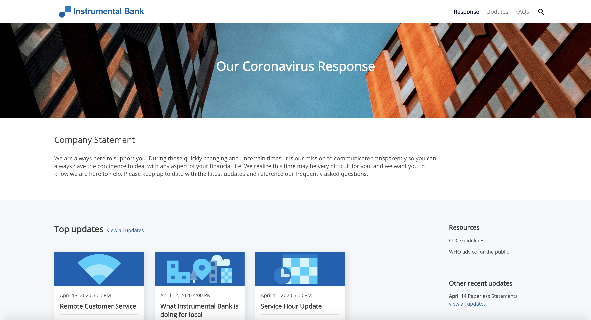

# React-Based “Coronavirus Response” Website Using Acoustic Content's Headless CMS

This is an example of how to create a modern website using the headless CMS features of Acoustic Content in combination with a Single Page Application (SPA) for the website. This sample is a React-based site, though the same concepts and content can be used with any web application or other delivery channel. That’s the great benefit of a headless CMS: the content and images are completely independent of the delivery channel. Your business users can manage all the content in one place and have it delivered across all channels - websites, mobile apps, emails, or any other channel. 



### Combining the React SPA with content and assets managed by business users

In this example you can see how business users can manage all the website components they need to manage, while the web developer provides the framework for the website.

The following components of the website are managed by business users in Acoustic Content:
- Home Page Introductory statement.
- Company information, logo, favicon.
- Update Articles, with Top (pinned) updates on the home page, and all updates shown on the Updates page. Clicking on an Update article's summary tile results in a dynamic page displaying the detail of the article on the website.
- Individual FAQ items, of which Top (pinned) updates are shown on the home page, and all FAQs shown on the FAQs page.
- All the images for the site content, using the Image Profile feature to automatically generate different size images.
- Resources, such as external links and social networks.
- Configuration options for the style guide, including the Font family and colors.

These components of the website are defined in the SPA which is built by a web developer:
- The React SPA framework with support for pulling in content and assets dynamically using Acoustic Content REST APIs.
- Top-level navigation (Home, Udates, FAQs). These are defined as routes in the SPA.
- Site look and feel, using Bootstrap styling with responsive web design so the site renders nicely on any device.
- Search for content in the site. The search input supports auto-complete, using the "faceted search" support of the Content delivery search API.

To see the dynamic pages of the site in action, try this after you've installed the sample:
- Create a new COVID Update content item. Fill out the text elements and select an image. Note that in the Article Text field you can use features of the rich text editor, including the ability to include images right inline with the text.
- On the COVID Update, turn on "Top Update and select the category and tags for the filtering functionality on the Updates page.
- Publish the new COVID Update.
- Open the website in a browser.
- On the home page, your new update should appear at the top of the list of updates (since it’s the most recent).
- From the Updates page, your new article should be listed, and you can filter by category and tag to find your update.


## Installing the Sample

### Prerequisites

In order to run Sample Site locally or hosted on Acoustic Content, the following is required:

- Acoustic Content Tenant;

- [wchtools-cli](https://github.com/ibm-wch/wchtools-cli) v2.3.4 or above;

- The latest Node 10.x LTS version of Node;

- Run `wchtools init` to setup the [WCH tools CLI](https://github.com/ibm-wch/wchtools-cli#getting-started);

- Download or clone this repository to get the React application code and "content-artifacts" to be deployed to your tenant.

### Update the source with your tenant information

1. You can set the tenant information, by changing the values in `src/api/endpoints.js`. This file determines from which tenant website gets served from.

   Inside `src/api/endpoints.js`, replace the values on the following lines to match your Content tenant:

```
export const DOMAIN_NAME = 'your-domain-name.com';
export const CONTENT_HUB_ID = '0000000-0000-0000-0000-000000000000';
```

The domain name can be extracted from the delivery URL of your site. (e.g. https:/domain_name/content_hub_id/).

All hub information including domain, IDs and URLs for the hub can be found inside Acoustic Content (_Sidebar > About > Hub Information_):

- Log in to Acoustic Content and open the 'About' tab.
- Click the 'Hub information' option.
- Find a delivery URL and hub ID on 'Hub Information' pop-up window.

2. Change Content hub ID (copy this from your Authoring UI's 'About -> Hub Information' panel) into the _homepage_ value inside `package.json`.

3. Edit `public/index.html` to replace the values on the following lines to match your Content tenant:

```
    var hostName = "https://your-domain-name.com";
    var tenantId = "00000000-0000-0000-0000-00000000000";
```


### Upload contents to Acoustic Content

1. Go to the directory where you have a downloaded folder with the Content Model files (it contains sub-folders named _assets, content-types, content, categories_ etc.);
2. Run `wchtools push -A --dir <Folder_Name> --publish-now` to push the Content Model to the Hub. If your content folder `content-artifacts` is located in a website sample root folder there is also a shortcut `npm run init-content`
3. Login to Acoustic Content to see that it contains uploaded content inside 'Content Model' and 'Content Library' sections.

### Run the site application on a local development server

1. Enable localhost CORS support for your tenant. Login to Acoustic Content and go to Settings, Administration, Security tab. Add http://localhost:3000 (or "*" for any domain) and save your settings.
2. Go to the folder with the application (it contains sub-folders named _src, public_ etc.) and install dependencies by running `npm install`.
3. Run `npm start` to start the development server and open the application in a new web browser tab on the `localhost`.

### Build and Deploy to Acoustic Content

_Note:_ If you haven't installed the sample locally, please go through sections **Prerequisites**, **Changing the tenant** and make sure to install project dependencies by running `npm install`.

Steps to deploy your sample:

1. Run `npm run hub-build-deploy` command. It will build and deploy the application to the specified hub.
2. To open the website on Acoustic Content, please use the following link type: _[delivery_URL]/coronavirus-response/index.html_
3. Note that publishing can take some time for all updates to be available. In case you do not want to wait for the server side akamai cache to time out you can flush the cache via: `wchtools clear --cache`. More information can be found here: [Clearing the content delivery network cache](https://github.com/acoustic-content-samples/wchtools-cli#clearing-the-watson-content-hub-content-delivery-network-cache).
